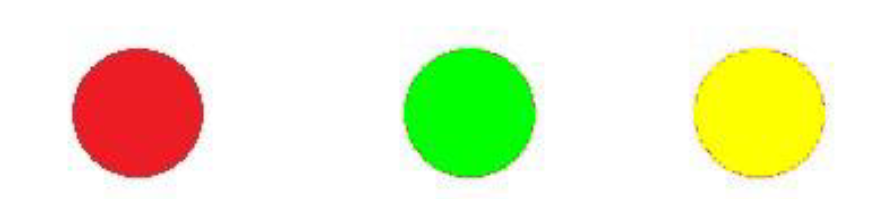
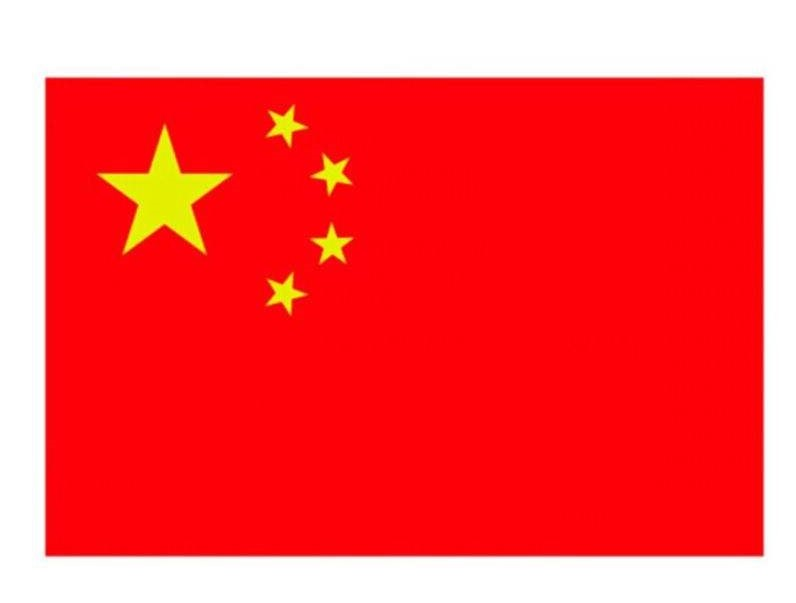
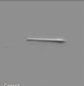
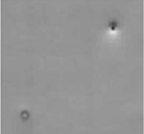
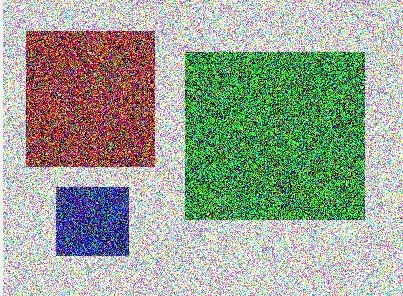
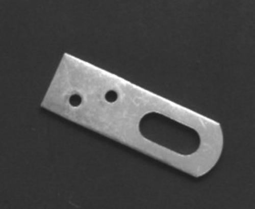
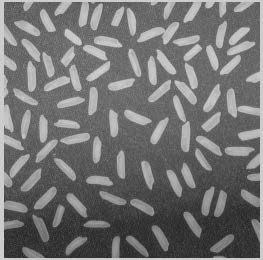
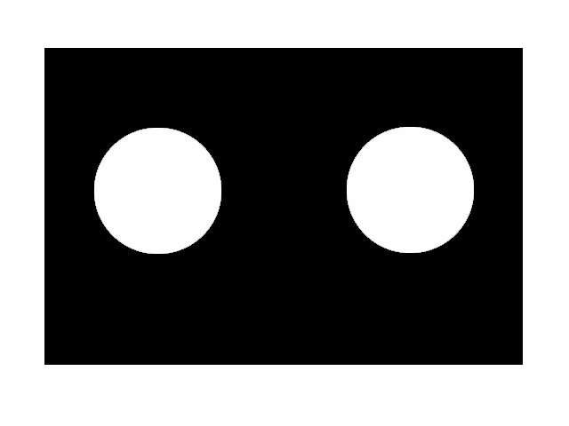
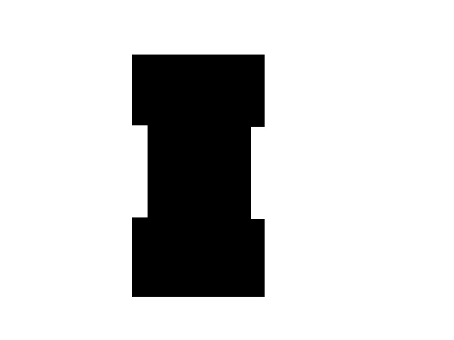
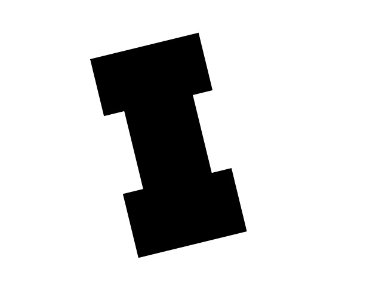

# The codes about *Image Processing and Pattern Recognition*

### practice 1

**1.1**  读取1幅图像（matlab）

**1.4**  创造一幅 100*100 分辨率，颜色为存在红色的图 （255,0,0），并保存为 文件 “red.bmp”（matlab）

**1.5**  使用VS和OpenCV打开一幅图（cpp）

**1.6**  分别打开下面三幅图，判断它们的颜色（matlab）

**1.7**  采用python和 opencv，实现图片载入显示保存；实现Matplotlib显示图像（python）

**reflection**  用简单的图像检测方法，实现中国国旗和日本国旗的检测判断.

---

### practice 2

**2.1**  使用函数API/自定义函数灰度化（matlab）

**2.2**  使用自己编写的直方图统计函数，统计它们的直方图信息，并显示（matlab）

**2.3**  自定义灰度化函数、直方图统计函数、阈值分割函数（matlab）

**2.5**  打开图像，依次灰度化、计算直方图、阈值分割、计算黄色部分面积（matlab）

**2.6**  打开 一幅图并将其直方图均衡化（cpp）

**2.7**  打开摄像头（捕获图片播放保存视频），以及使用滑动条（python）

**reflection**  检测出两幅图中缺陷的位置，大小，周长等参数.

---

### practice 3

**3.2**  阈值分割（cpp）

**3.3**  检测白底黄块(1个)图像中的黄色块面积（cpp）

**3.4**  检测白底黑块(2个)图像中的黑色块面积（cpp）

**3.5**  检测白底黑块(多个)图像中的黑色块面积（cpp）

**3.7**  blob检测（cpp for *two-pass algorithm*）

**3.8**  计算物体质心（cpp）

**3.9**  灰度化，滤波，阈值分割，计算物体面积（cpp）

**3.10**  颜色空间转换，OTSU阈值分割（python）

**reflection**  打开视频并播放，同时实时检测红色的物体

---

### practice 4

**4.1**  编写程序实现梯形物体的blob多次扫描，并给其贴上正确的标签（matlab）

**4.2**  读取图片，灰度化，添加噪声， 中值滤波/ 高斯滤波（matlab）

**4.3**  读取白底黑色块(4个噪声点)图像，灰度化，高斯滤波， 计算直方图，根据直方图阈值分割， 

​		自己编写blob算法，四连通区域贴标签，计算贴标签的面积（matlab）

**4.5**  图像滤波（cpp）

**4.7**  对噪声照片滤波并计算面积（cpp）

**4.8**  实现图像几何变换(旋转平移缩放仿射变换透视变换)（python）

**4.9**  实现绘图功能(画线画圆画矩形添加文字)（python）

**reflection**  检测零件上两个小孔之间的距离

---

### practice 5

**5.1**  读取图像，灰度化，设定模板，图像腐蚀（cpp）

**5.2**  读取图像，灰度化，设定模板，图像膨胀（cpp）

**5.3**  大米检测 -  读取图像，估计图像背景，从原始图像中减去背景图像，调节图像的对比度，二值化，连通体标记（cpp）

**5.4**  圆心距离测距 - 读取图像， 检测两个圆的圆心， 检测两个圆的圆心的距离（cpp）

**5.8**   “工字件”最短边距离的测量 - 读取图像，检测左右“两个最接近”边的距离（cpp）

**5.9**  旋转的“工字件”最短边距离的测量 - 读取图像，检测左右“两个最接近”边的距离（cpp）

**5.10**  实现图像混合(算数运算混合按位运算)（python）

**5.11**  实现平滑图像(卷积滤波模糊降噪)（python）

**reflection**  

---

### practice 6

**6.1**  信息隐藏 - 读取图像A与B，改写图像A的每个像素的最后一位，将图像B隐藏其中（matlab）

**6.2**  信息提取（matlab）

**6.3**  任意大小图片隐藏和提取（matlab）

**6.5** 实现图像中人眼鼻口的检测和定位（cpp）

**6.6** 车牌识别（matlab/cpp/python）

**6.7**  (1) 边缘检测(Canny/Sobel)，腐蚀与膨胀(形态学操作开运算闭)（python）

---

### practice 7

**7.1**  相机标定（matlab）

**7.2**  相机标定（cpp）

**7.3**  打开 摄像头，灰度化，阈值分割，blob分析（cpp）

**7.4**  读取9种不同的种子图，图像预处理，图像分析，获得种子的个数 （cpp）

**7.5**  寻找&绘制轮廓（python）

**7.6**  寻找面积周长最小外接矩(圆)，形状匹配（python）

---

### practice 8

**8.1**  打摄像头，灰度化，阈值分割，blob分析（cpp）

**8.2**  数种子（cpp）

**8.3**  绘制直方图并进行直方图均衡化，模板匹配(大图中找小)，霍夫变换(提取直线圆)（cpp）
